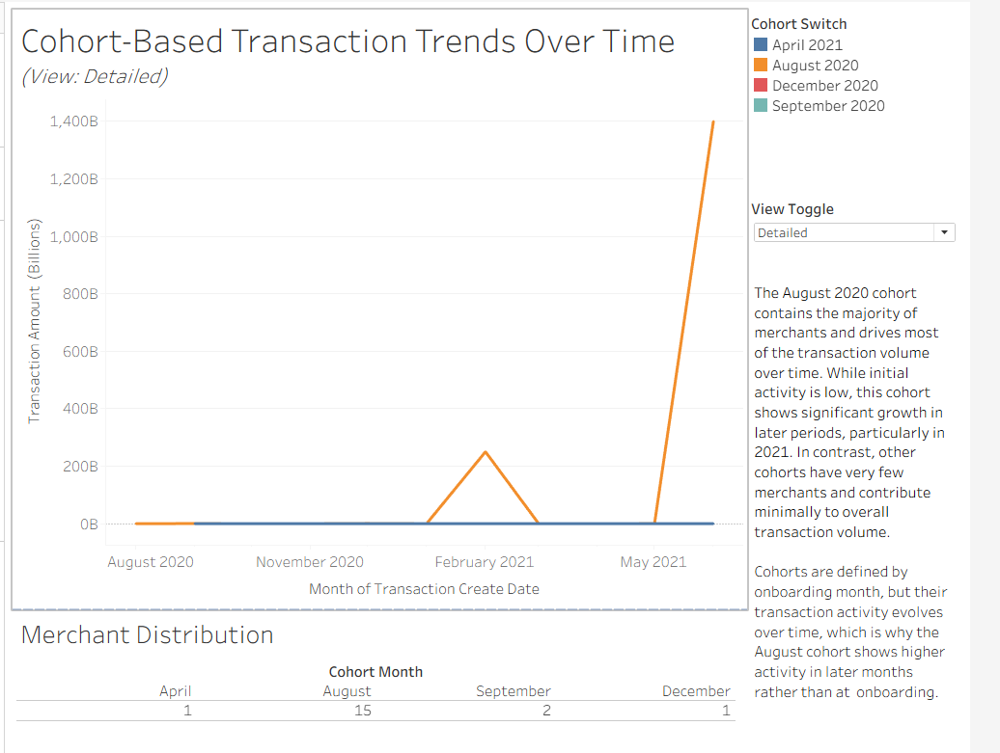
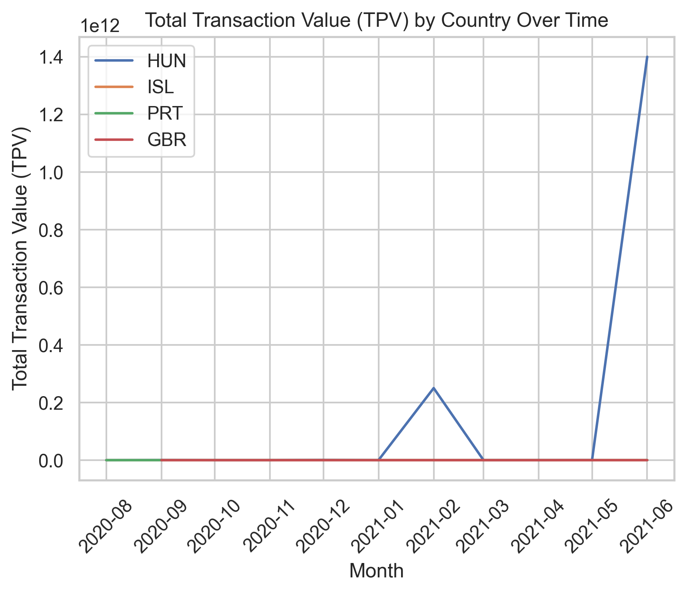
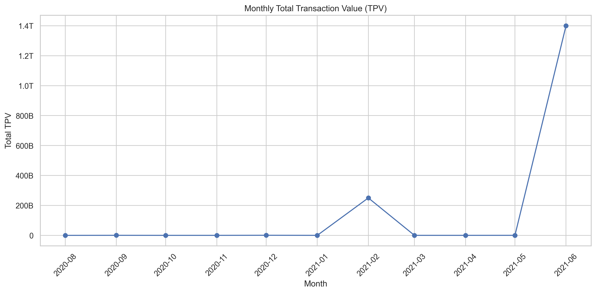

# Merchant Transaction Analytics

## Overview

Merchants are the primary customers of payment processing platforms such as Stripe, Adyen, Square, and Checkout.com, relying on these services to securely accept and manage customer payments. Understanding merchant transaction behavior is essential for monitoring business performance, identifying growth opportunities, and supporting strategic decision-making. This project analyzes multi-country merchant transaction data using SQL, Python, and Tableau to uncover transaction trends, merchant cohorts, seasonality patterns, and business performance insights. The analysis combines data preparation, exploratory analysis, statistical trend evaluation, and interactive dashboards to deliver actionable insights that support merchant growth and operational decision-making.


---

## Dashboard



## Country Transaction Trends



## Seasonality Analysis



---

## Business Questions

The analysis focuses on answering the following questions:

* How should merchant transaction data be prepared for downstream analytics?
* How do merchant transaction volumes evolve over time?
* Which merchant cohorts contribute most to transaction value?
* How does merchant performance compare month over month?
* Are there meaningful seasonal patterns within transaction activity?
* Which merchants or countries contribute most to overall transaction value?

---

## Dataset

The dataset contains merchant transaction records across multiple countries and currencies.

The analysis includes:

* Merchant transaction history
* Merchant ID mapping
* Transaction timestamps
* Transaction amounts
* Merchant onboarding dates
* Country information

---

## Tech Stack

* SQL (PostgreSQL)
* Python
* Pandas
* Matplotlib
* Tableau
* Git & GitHub

---

## Methodology

The project was completed using the following workflow:

* Cleaned and transformed transaction data using SQL.
* Mapped historical merchant IDs to maintain continuity.
* Generated merchant rankings and onboarding cohorts using SQL window functions.
* Performed exploratory data analysis using Python.
* Conducted transaction trend and seasonality analysis.
* Built interactive Tableau dashboards for merchant performance monitoring.
* Developed business recommendations based on analytical findings.

---

## Key Metrics

* Total Payment Volume (TPV)
* Month-over-Month Growth
* Merchant Cohort Performance
* Merchant Tenure
* Transaction Counts
* Country-Level TPV
* Seasonal Trends

---

## Key Findings

* Merchant transaction value demonstrated clear temporal trends with recurring seasonal patterns.
* Cohort analysis highlighted differences in long-term merchant contribution across onboarding periods.
* Month-over-month comparisons identified periods of accelerated and declining transaction activity.
* Country-level analysis revealed concentration of transaction value across key markets.
* Merchant-level ranking enabled identification of high-value merchants and onboarding performance.

---

## Recommendations

Based on the analysis, the following improvements are recommended:

* Continuously monitor merchant cohorts to identify changes in long-term performance.
* Investigate seasonal transaction fluctuations when planning operational capacity.
* Prioritize merchant acquisition strategies based on high-performing onboarding cohorts.
* Track month-over-month performance to detect emerging business trends.
* Build automated dashboards for ongoing merchant performance monitoring.

---

## Repository Structure

```text
README.md
transactions_analysis.sql
merchant_analytics.py
Merchant_Analytics_Dashboard.twbx
Merchant_Transaction_Analysis.pdf
new_transactions.csv
transactions_onboarding.csv
dashboard.png
tpv_by_country_over_time.png
monthly_tpv.png
monthly_tpv_mom_growth.png
weekly_tpv_rolling.png
avg_tpv_by_day.png
heatmap_hour_day.png
```

---

## Skills Demonstrated

* SQL (Window Functions, Joins, CTEs)
* Python
* Pandas
* Data Cleaning & Transformation
* Exploratory Data Analysis
* Cohort Analysis
* Time Series Analysis
* Seasonality Analysis
* Tableau Dashboarding
* Business Storytelling
* Data Visualization
* Data-Driven Decision Making

---

## Author

**Mukta Deshmukh**

Data Analytics | Product Analytics | Business Intelligence

**Core Technologies:** SQL • Python • Tableau • PostgreSQL • Git
